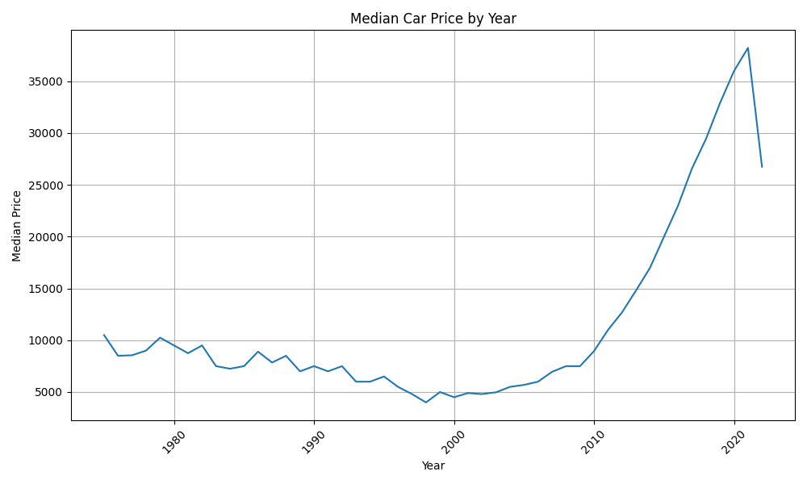
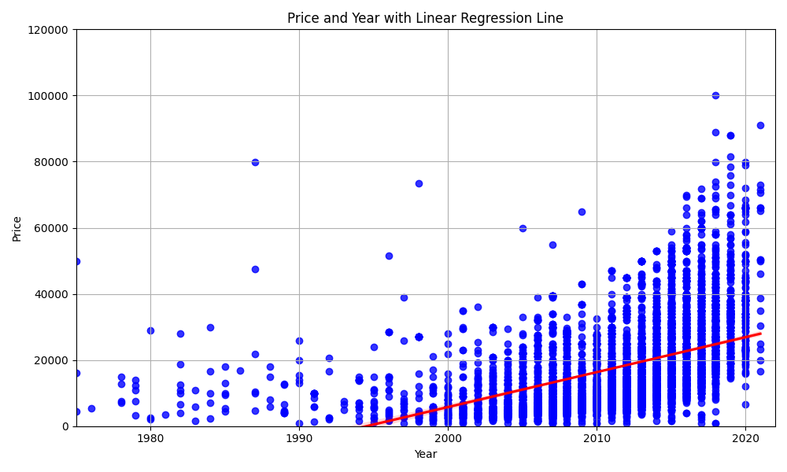
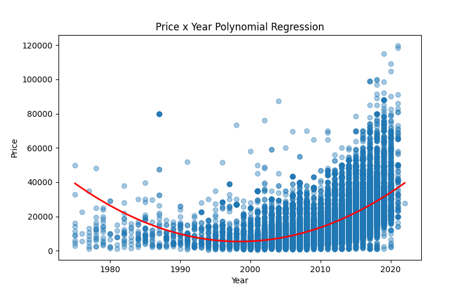
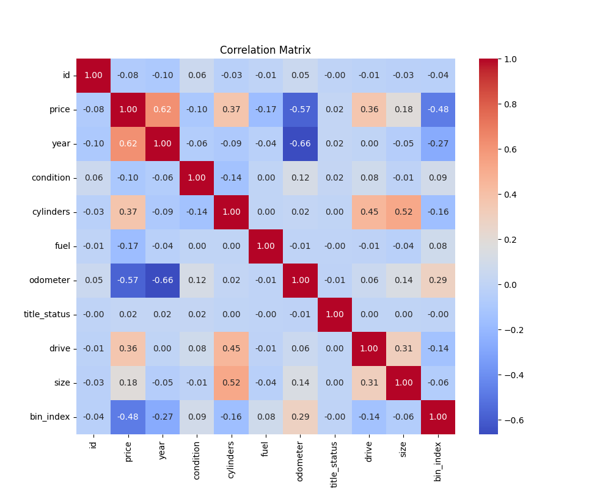
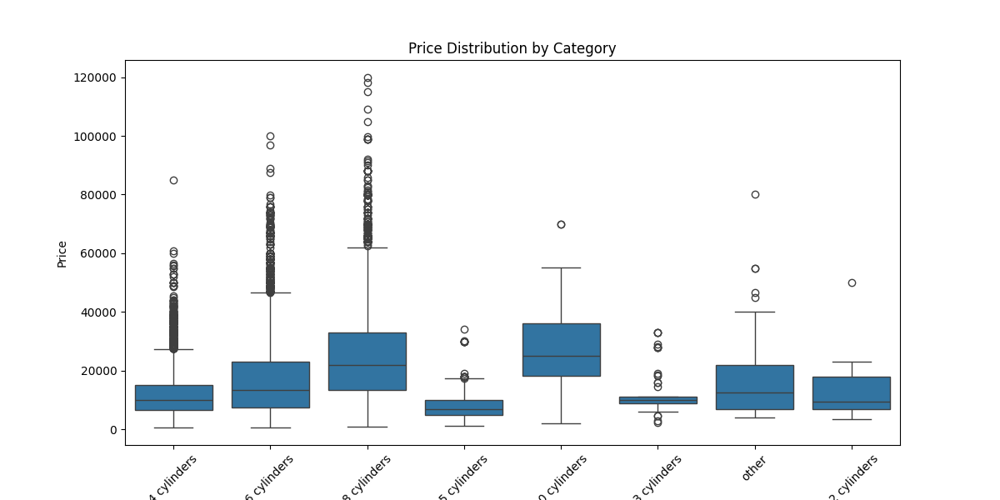

# Executive Summary
The purpose of this report is to assist used car dealerships in determining what consumers value in a used car.  This will assist dealerships in reducing operating costs and increasing profit. 

The year of the vehicle was the biggest driver to the price of the vehicle.  Second, the odometer reading or current mileage of the vehicle was the next driver.  Typically, the newer the vehicle the less miles it has. Vehicles within the last 10 years are more desireable and have a higher price point than older car.  The median price for vehicles within the last 20 years has a significant differnce in comparison to the median price for vehicles with the last 10 years.  The difference in price is about $10k. Cars with ages in the 30-50 years had a median price gernerally in the same range ($16,500-$16,881).  

Luxury cars are a separate class of their own and is recommended that these used cars should be reserved for, or sold to, used luxury car dealerships as they typically specialize in maintenance of these cars as well.  Thus vehicles over $120k, were classified separately. 

The recommendation would be to keep inventory to cars within the last 10 years and under 50K miles on the odometer. Interestingly, white, black, and silver are the top color choices for cars. Same holds true for luxury/exotic cars. Vehicles with the 8 cyclinder feature appeared to be most popular with ford and chevy trucks. 

## Problem Statement: 
Help used car dealers interested in fine-tuning their inventory.

## Data Description:
The dataset contains information on used car.  Sourced from a Kaggle dataset.

## Analysis
The year of the car was the biggest factor on the price.  Calculating the mean price of the car over a shorter period, while keeping the newer vehicles and dropping the older ones had an increase in median price. Cars over 20 years old did not provide a significant increase in the median price, while cars within the last 10 years proved to have the highest price mean.

Median Price
1975-2024   $16,500
1985-2024   $16,590
1995-2024   $16,881
2005-2024   $17,995
2015-2024   $27,988

Median price of cars within the last 50 years

The data of price to year was not quite linear and was higher in the more recent years.

8 cylinder cars appeared to be popular amongst consumers with the ford and chevy trucks.

While vehicles in the 8 cylinder category did not have the highes median in contained a high amount of outliers in the upper price range.

## Supplemental - Luxury/Exotic Cars
These vehicles were typically higher in price which skewed the data on pricing.  Due to the higher cost of the vehicle, the operating costs (storing, securing, insurance, maintenance, parts) would cost more for dealerships.  Typically these vehicles can be found at used dealerships that specialize in luxury/exotic cars.  As one may expect, this would also attact a different segment of customers as well. 

Data points to highlight:
* They all have a clean title. 
* Topping the list of the manufacturers are mercedes-benz, ferrari, and porsche. 
* There are less older exotic vehicles.  Any oler models these are generally rare and may be considered collectables.
* No exotic/luxury cars with odometer readings over 250,000 miles in our dataset.  With the highest topping out at 217,000 miles.
* There are some records with mileage under 50 miles which would be classified as new. Which also eliminates them from the used car dataset. 
* Transmission in these higher price range cars have a higher percentage (84.3%) with a classifcation of excellent, like new, good. 
* Most of the transmisison is automatic.

# APPENDIX: Supporting Artifacts
* prompt_ii.ipynb - main notebook with business reasoning and cases
* image directory - contains plots used in the report
* supp directory contains notebooks used for EDA and luxury vehicle analysis
    * eda.ipynb - jupyter notebook used during exploratory data analysis
    * luxury.ipynb - jupyter notebook fun EDA on luxury/exotic cars 
