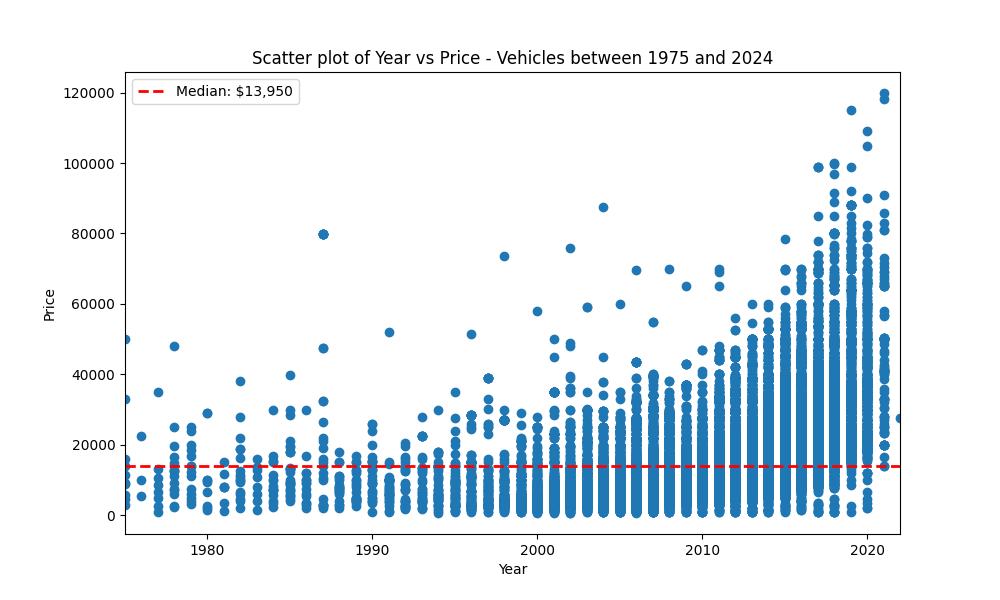
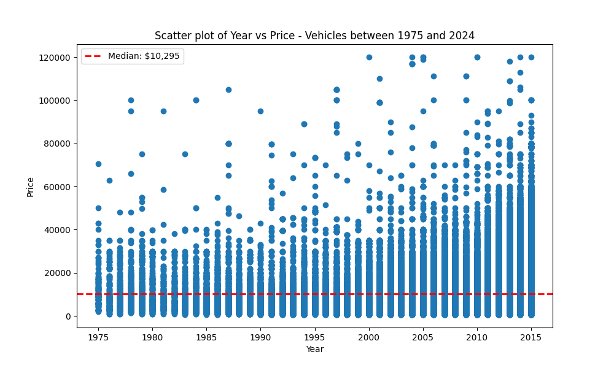
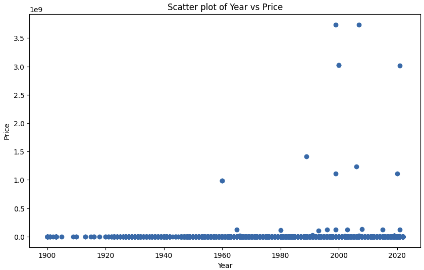

# What drives the price of a car?
*This README file will serve the purpose of a delivered report to the customer(A used car dealership).*  

There are 2 files here currently: 
* eda.ipynb - jupyter notebook used during exploratory data analysis
* luxury.ipynb - jupyter notebook fun EDA on luxury/exotic cars 
* prompt_ii.ipynb - main notebook with business reasoning and cases

Some initial analysis shows that the number or cars start to tail of in the 1990s so we're going to use data between 1995 and 2024 which is about 30 years of data. The median price did not change much going from a 50 year window to a 30 year window. 

Median price from 1975-2024

Median price from 1995-2024

----

# Fun Luxury EDA
*Separated out a quick analysis on EDA to get some fun points on luxury/exotic vehicles.*

*Why?*
 Luxury/exotic vehicles are higher in price which will skew the data.  There are typically specialty dealships for these type of vehicles as there are for motorcyles as well. 

Data points found during EDA of these vehicles. 
* They all have a clean title. 
* Topping the list of the brands are mercedes-benz, ferrari, and porsche. 
* There are less older exotic vehicles.  A lot of these are generally even more rare and collectables.
* No exotic/luxury cars with odometer readings over 250,000 miles in our dataset.  With the highest topping out at 217,000 miles.
* There are some cars with mileage under 50 miles which would be classified as new. 
* Transmission in these higher price range cars have a higher percentage (84.3%) with a classifcation of excellent, like new, good. 
* Most of the transmisison is automatic

----

# Supplemental
Some data plots created in EDA, pre data cleaning: 

