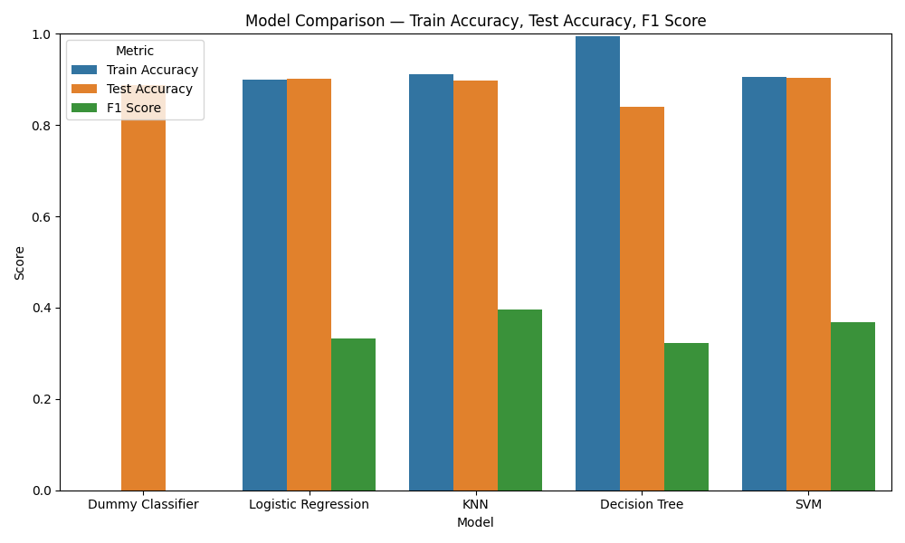
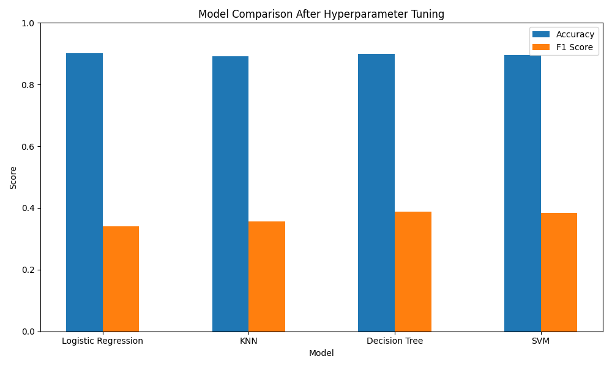
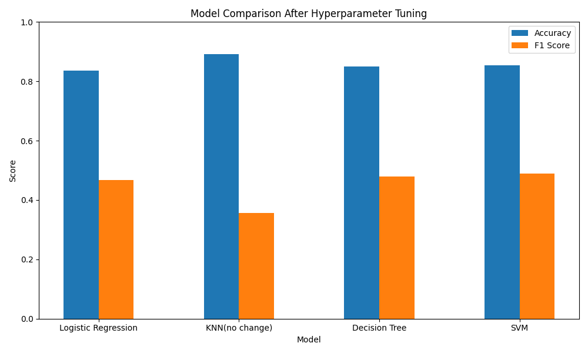
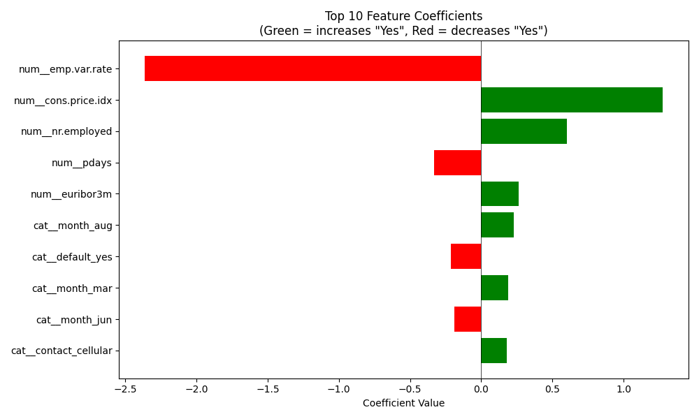

# Practical Assignment 3 - Classification

## Executive Summary
The dataset collected is related to 17 campaigns that occurred between May 2008 and November 2010. 

## Business Objctive
The classification goal is to predict if the client will subscribe a term deposit (variable y). The task is to finding the best model, that would be helpful in chieving that goal. 

## Baseline Performance 

| Model | Train Time | Train Accuracy | Test Accuracy | F1 Score | 
| ----- | ---------- | -------------  | -----------   | -------- | 
| dummy classifier    |  0.0  |0.8874     |.     |     |
| LogisticRegression | 0.2s | 0.8998 | 0.9007 | 0.3317 | 
| KNN | 0.5s | 0.9120 | 0.8967 | 0.3969 | 
| Decision Tree | 0.3s | 0.9954 | 0.8395 | 0.3227 | 
| SVM | 1m 13.2s | 0.9049 | 0.9031 | 0.3687 | 

## Improving the model by finding optimal hyperparameters.
| Model | Train Time | Test Accuracy | F1 Score | 
| ----- | ---------- | -----------   | -------- | 
| Logistic Regression | 3.6s | 0.9012 | 0.3414 | 
| KNN | 7.7s | 0.8925 | 0.3571 | 
| Decision Tree | 4.8s | 0.9002 | 0.3884 | 
| SVM | 3m 44s | 0.8949 |  0.3841 | 

## Additional improvements using balanced weights
| Model | Train Time | Test Accuracy | F1 Score | 
| ----- | ---------- | -----------   | -------- | 
| Logistic Regression | 8.9s | 0.83512 | 0.4675 | 
| Decision Tree | 4.5s | 0.8499 | 0.4800 | 
| SVM | 3m 48.8s | 0.8532 |  0.4901 | 
* No change in KNN (balancing does not apply)

## Top 10 Feature Coefficients

