# Using Text Classification to Suggest Topic FAQ/Documentation

**Ed Martinez**

## Executive Summary
The goal of this project is to identify and evaluate the best model for classifying IT Support ticket types as suggest a link to relevant documentation.  This will help save time for internal users as well as IT Staff in resolving issues. Thus allowing time to improve service and allocate resources to create and improve workflow automations for the company. 

**Problem Statement**  
IT support teams are occupied with unclassified tickets, which slows down ticket routing and triage. The goal is to reduce the number of repeat questions and time spent by auto-classifying tickets. In addition a FAQ Response System to respond to the internal user base. It will help reduce repeatble tasks and the insights will also serve as a precursor to agents and a chatbot. 

## Data Engineering
**Label Engineering**  
Using domain knowledge a keyword mapping was created prior to the start of the analysis. It was intended to be used as a base for our labels and classification.  

```
keyword_map = {
    'password':       ['password', 'passwd', 'reset', 'forgot', 'login', 'credential','locked'],
    'security':       ['security', 'virus', 'malware', 'breach', 'phishing', 'firewall', 'threat','vulnerability','encryption','compliance','2fa','two factor','breach','firewall','phishing'],
    'hardware':       ['hardware', 'printer', 'monitor', 'keyboard', 'mouse', 'laptop', 'device','screen','need a','cable','connector','desktop','paper jam','hard disk','no signal'],
    'software':       ['software', 'install', 'update', 'upgrade', 'application', 'app', 'license','api','integration','export','configure','error message','not saving','feature'],
    'system':         ['system', 'computer', 'server', 'crash', 'reboot', 'outage', 'slow','windows','mac','machine'],
    'access_request': ['account', 'access request', 'permission', 'request', 'grant', 'role', 'privilege','newhire','username', 'user', 'deactivate','suspend','reactivate','profile'],
    'network':        ['network', 'wifi', 'internet', 'vpn', 'connection', 'connect','connectivity','bandwidth', 'dns','ethernet'],
    'platform':       ['platform', 'portal', 'dashboard', 'interface', 'vm', 'container','cloud'],
    'other':          []  # This will be our default/catch-all category for unmatched issues
}
```
### Data Sources
For this project, a total of 4 datasets were used.  This type of data across any organization can contain sensitive information, revealing names, usernames, applications, platorm information, network architecture etc.  All viable information that malicious characters may use to carry out an attack.  After EDA, the 4 datasets were concatenated together in order to form a viable dataset for our analysis.  

1. 1st dataset source: [https://www.kaggle.com/datasets/utsav15/it-helpdesk/data](https://www.kaggle.com/datasets/utsav15/it-helpdesk/data) 
2. 2nd dataset, same source, additional file. [https://www.kaggle.com/datasets/utsav15/it-helpdesk/data](https://www.kaggle.com/datasets/utsav15/it-helpdesk/data)
3. Source: https://www.kaggle.com/datasets/ahsanneural/synthetic-it-support-tickets
4. [https://huggingface.co/datasets/Console-AI/IT-helpdesk-synthetic-tickets/tree/main](https://huggingface.co/datasets/Console-AI/IT-helpdesk-synthetic-tickets/tree/main)

Our final dataset resulted in 685 records for analysis. 

**Included notebooks**  
[capstone_eda](capstone_eda.ipynb)  
[capstone_modeling](capstone_modeling.ipynb)  
[capstone_deployment](capstone_deployment.ipynb)  

### Analysis
We use a combinarion of NLP preprocessing steps (lowercasing, punctuation removal, steop word filtering) to find the most common words used for each dataset. This aligned well with our keyword mapping and will contribute to our next steps in automated agents and a chatbot.  
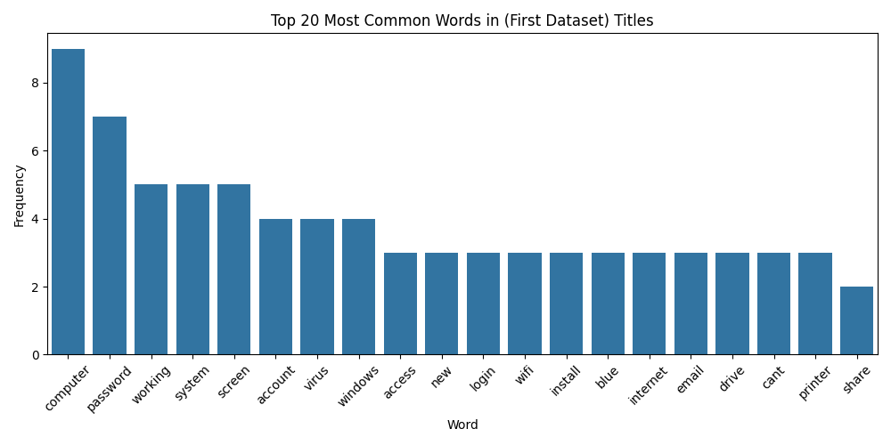
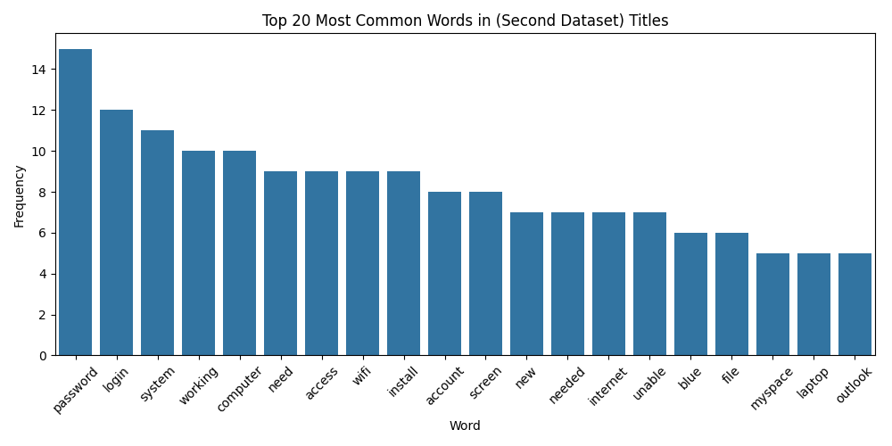
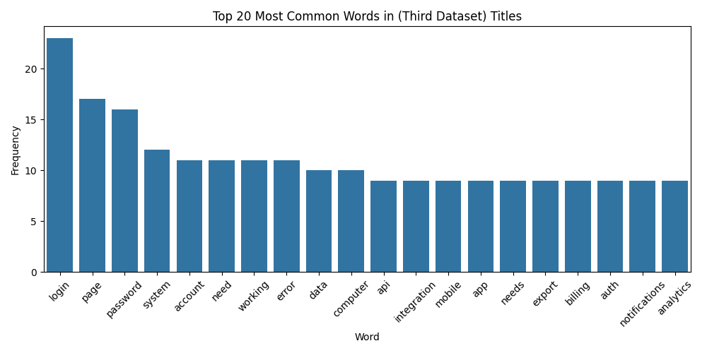
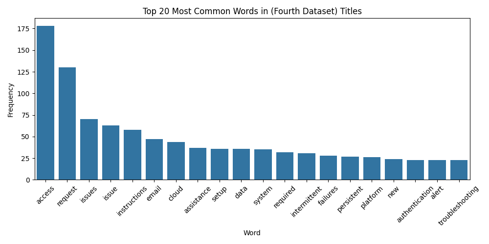

Interestingly, a look at our word distribution indicated that the word count of each ticket title/subjet were between 5-10 words.
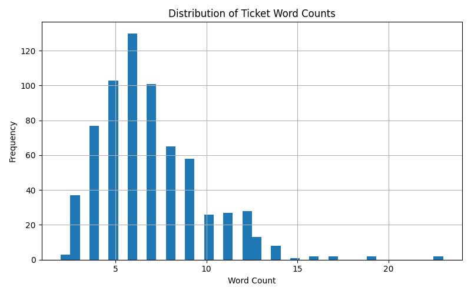

The top n-grams for each classification. 
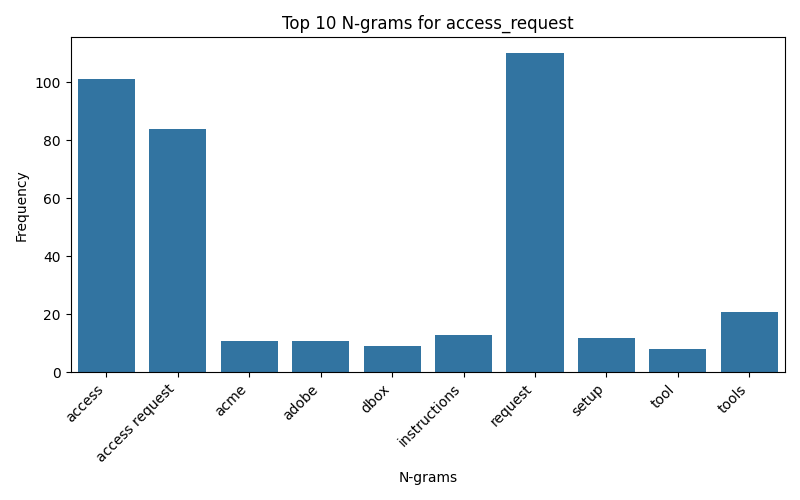
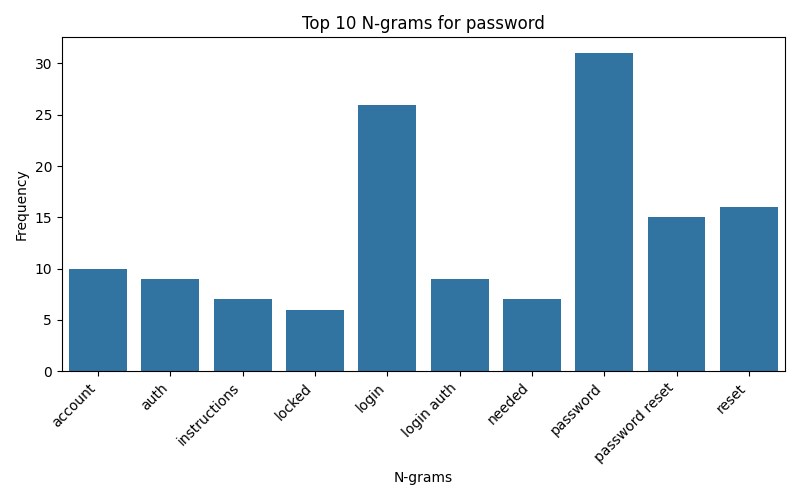
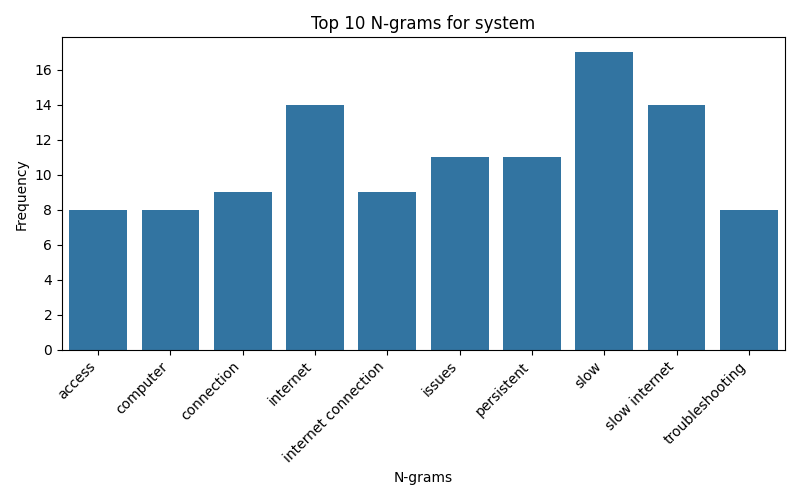
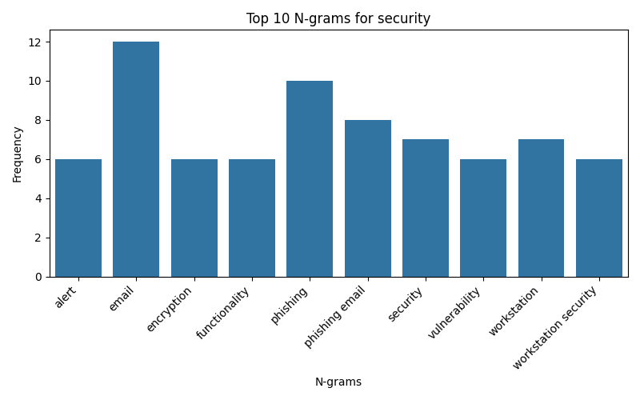
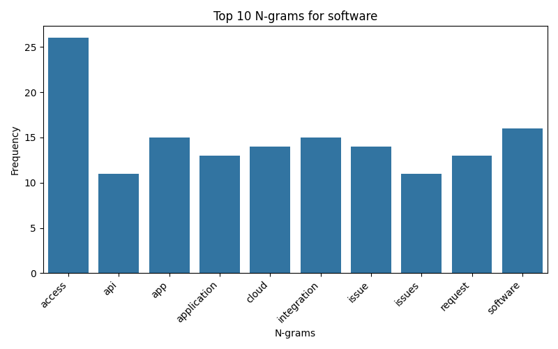
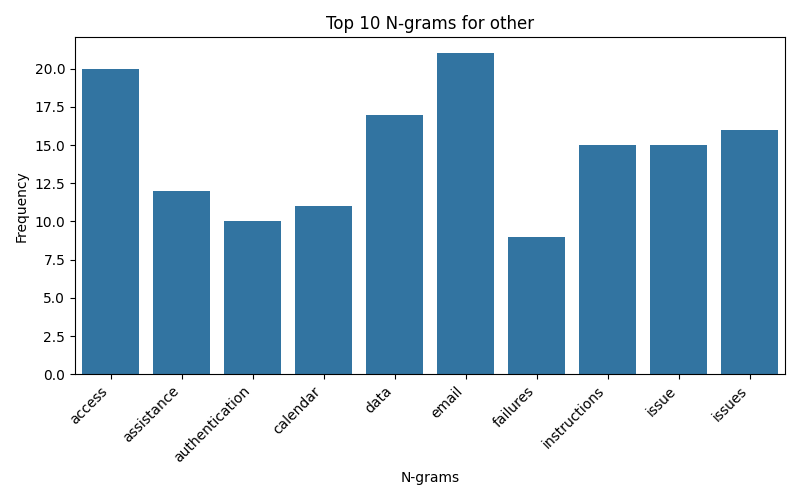
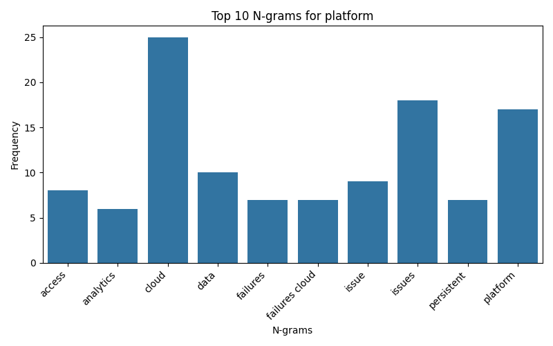
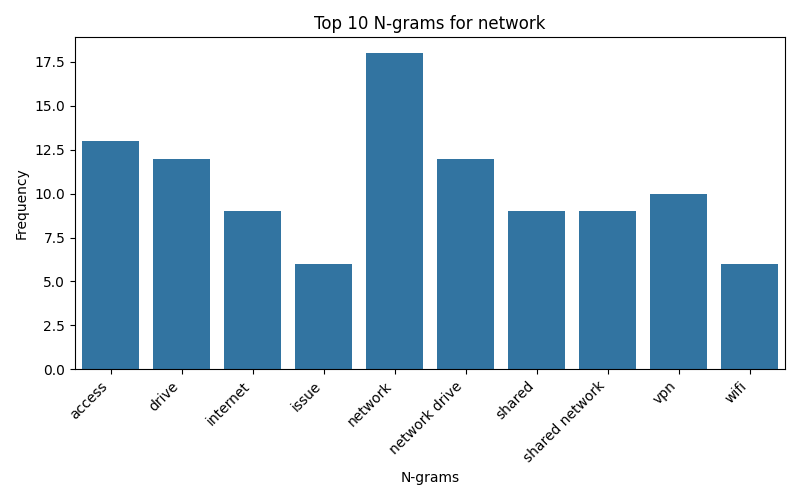
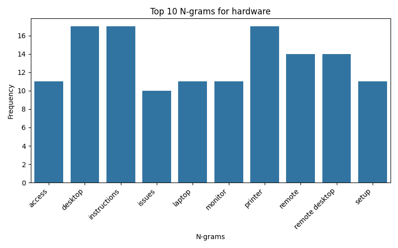

I decided to go with Naive Bayes as our intial baseline model.  It is known to be a good baseline classifier for text classification.  
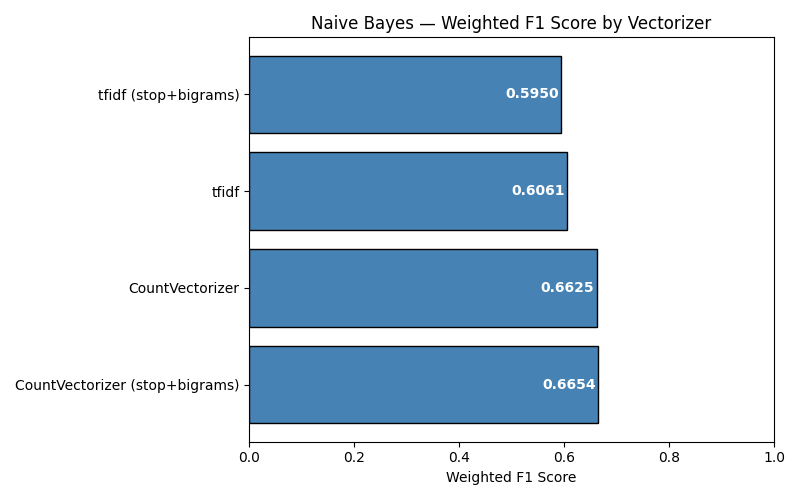

Train / Test Split
The dataset was split **80 / 20** into training and test sets.  

The top baseline model score 0.6654, and was used as our baseline score to beat.

I ran though a manual comparison of additional models: Logistic Regression, linearSVC, and Random Forest each using CountVectorizer and TfidfVectorizer and interestingly Random Forest + Tfidf was the front runner prior to running a grid search cross validation for optimal hyper parameters. During model comparison, a pipeline was used to prevent data leakage.  

## Results
Top Model is **LinearSVC** with CountVectorizer with an F1 score of: 0.8390
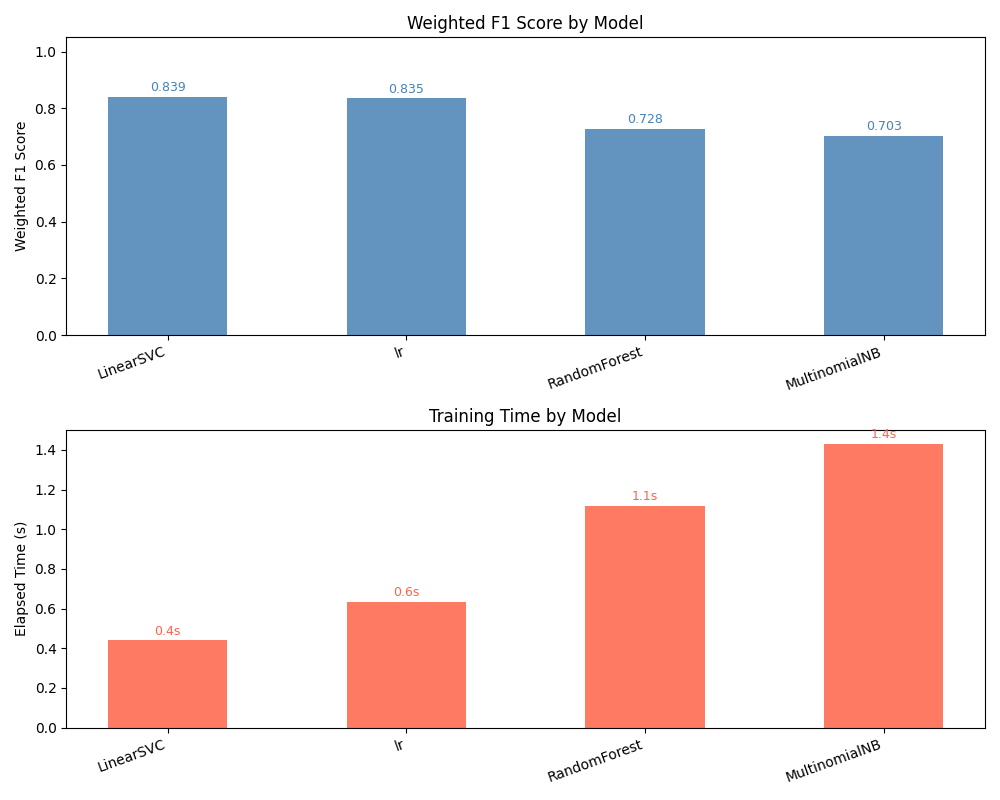

## Next Steps
* Continuously update the FAQ pages and documentation. 
    * Review available resolutions in our dataset and update the documenation.
* Improve the model with additional data. 
    * Aanalyze tail data or data outside the standard deviation.
    * Add additional data for some of the weaker classes  - security, platform, system. 
* Review top words and for each dataset.  Ensure proper classification is returned for specific phrases.
    * Experiment with n-gram ranges to improve the model. 
* Sentiment analysis to determine priority of tickets/issues. ie. (urgent)
* Revaluate classification labels with and without our mapping to see if any additional classifications surface and need to be 
 implemented in our ITSM(IT Service Mangement) system. 
* Other is a catch all and there may be some classes entering the class.  However, one can argue that some of these classes like hardware, system, software, and platform are specific to its environment.  So the model would have to be tailored as such. 
* Titles such as "I have a general question about my account." - are classified as access_request, which is not entirely wrong but should probably be other - or in a separate category for general inquiries. Experimenting with n-grams and/or rearranging our keyword map order may help and require further testing. 

## Deployment 

### Appendix: Environment Setup
To run the included notebooks, install the following libraries if not already present: 
* openpyxl - required for 2nd dataset.  
* streamlit, pydantic, fastapi, joblib, uvicorn - in order to run the documentation server in the ~/deployment directory 
* pandas, scikit-learn - for data analysis and model evaluation
* nltk - used for tokenization, stop words
* matplotlib, seaborn - data handling and visualization

### Instruction
You will need to run the 1 fastapi server, and 2 streamlit servers.  You can run each process in a separate terminal app or background
each process

Run API server
```
$ uvicorn app_api:app --reload
```

Run Streamlit servers.

In another terminal window, run the streamlit server for our documentation by running the command below: 
```python
streamlit run wiki_app.py --server.port 8501
```

In another terminal window, run the streamlit server for our documentation by running the command below: 
```python
streamlit run app_pred_ui.py --server.port 8502

Testing steps are included in notebook: [capstone_deployment](capstone_deployment.ipynb)

```


