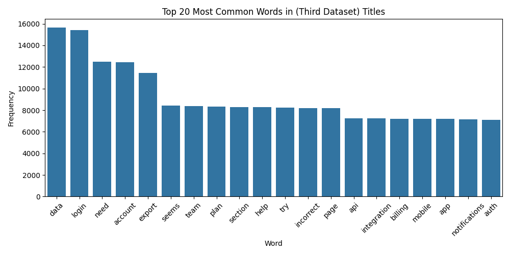

# Capstone Assignment 20.1: Initial Report and Exploratory Data Analysis 

## Problem Statement:
Reduce the number of repeat questions and time spent by creating an FAQ Response System. To be scored on the questions asked/classified correctly.  This will serve as a precursor to a chatbot that will be implemented in the workplace.

EDA Notebook: [eda.ipynb](eda.ipynb)

# Datasets
*  [https://www.kaggle.com/datasets/utsav15/it-helpdesk/data](https://www.kaggle.com/datasets/utsav15/it-helpdesk/data)

After analyzing several datasets, not just the ones above. I was able to compile a list of categories for my classifier.  These labels wll be 
* password
* system
* account
* access
* network
* platform
* hardware
* software
* security
* other

If I were to build in some N-gram logic in the future, here would be the classification map. However a keyword classification map can be found in the notebook. 

1. password = "my password doesn't work","my password does not work","i forgot my password", "forgot password","reset password","account locked", "account got locked", "account is locked", "can't login","unable to login","login issue","login credentials are not working","login problem","login problems","login page"
2. system = "computer","power","windows","safe mode", "blue screen", "VM"
3. account = "new account","access request", "login", "create login credentials"
4. access request = "access request", "new account","login","permission"
5. network = "wifi","unable to connect to wifi","connect","network connectivity", "unable to connect","internet is not working","internet","connect", "connectivity", "IP Address"
6. platform = "data center services", "vm request", "report VM issue"
7. hardware request = "need a","screen", "mouse","cable","connector"
8. software = "install, 
9. security = "virus","unauthorized access", "virus detected", "virus message"
10. other = "email","printer"

The most time consuming part of the process (the EDA) is finally complete. I analyzed several datasets, most of which were unusable and finally found one that fits the use case. 

The classification report for our base model did not report on all unique labels, so that is something to improve in the final capstone project. 