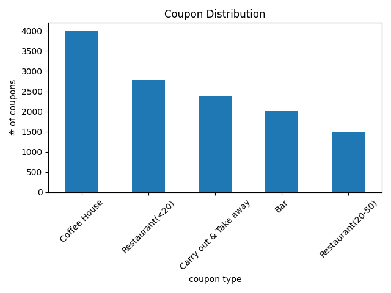
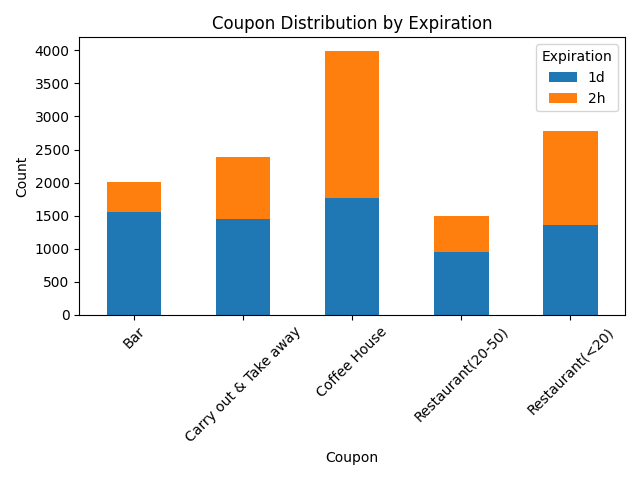
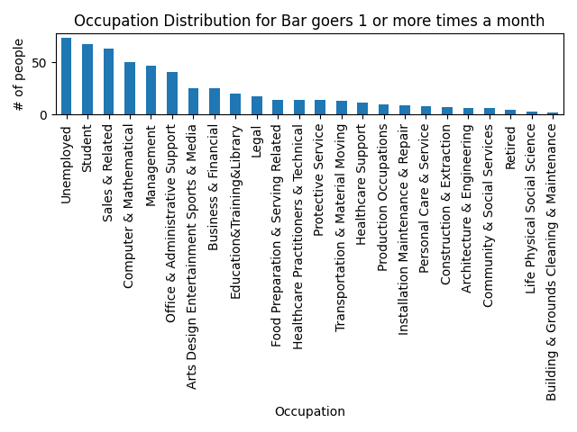

# WEEK 5 ASSIGNMENT - Report and Findings
**Objective**: Highlight the differences between customers who did and did not accept the coupons.  

Side note: For me, a coupon would not have any impact on whether or not I would make a stop.

### Findings:
After an initial analysis, there was some data cleaning to be done as was expected: 
* There was an age value of "below21" which we set to 20, so that we can plot and compare appropriately.  The only relative significance would be when we examine which age groups used the Bar coupon.  The below21 age group should not have any usage of using the coupons at the bar. 
* We converted the age value of '50plus' to '50' to keep integer values.
* The 'passenger' column was spelled incorrectly so it was renamed from 'passanger' to 'passenger'.

### Analysis
* It's almost an even split percentage wise between genders who accepted the coupon.  
* The folks in the age group 21-31 were more likely to accept the coupon.
* Folks with a destination of 'No Urgent Place' were more likely to accept the coupon over subjects heading home or to work. 
* Folks that were traveling alone or with a friend(s) were more likely to accept the coupon over folks traveling with a partner or their kid(s).

**Hypothesis:**  Why would the type of car matter on whether a coupon is/was accepted or not?
* After examining the data, the conclusion is that it did not matter.  Only .85%, less than 1%, of records provided a value for car data. This column was dropped for the rest of the analysis.  

**Hypothesis:** Does eduction have an impact on whether a coupon is used.  My theory was it did not.  I would think that folks in the higher eduction (some gollege or higher) would be less likely to use coupons because it was unplanned costs and would not be saving money.  However, quite the opposite is true.  Higher eduction levels correlate with higher coupon usage.  

**Hypothesis:** Following up on our assumption earlir implied that any person(s) under the 21 would not be using the coupons at the bar.  To my surprise there were 36 people below 21 who used a coupon at the bar. 

**Proportion of total observations:**
* 56.84% of the total observations chose to accept the coupons.
* 'Coffee house' had the most coupons distributed.

**Investigating the Bar Coupons**
* 41% of bar related coupons were accepted.  Thankfully, this was the lowest acceptance rate of the options as we don't need intoxicated drivers on the road. 
* Surprisingly, subjects who went to a bar 3 or fewer times a month accepted the coupons more than the folks who went more than 4 times a month. They account for 80.5% of the total acceptance of bar coupons.
* Drivers who go to a bar more than once a month and are over the age of 25 had an acceptance rate or 35.3%. 

Acceptance rates between drivers who:
- go to bars more than once a month, had passengers that were not a kid, and were not widowed (66.7%)
- go to bars more than once a month and are under the age of 30 (41.7%)
- go to cheap restaurants more than 4 times a month and income is less than 50K. (32.6%)o

The top 2 occupations for bar goers that go 1 or more times a month are:
1. Unemployed
2. Student

### Independent Investigations
* 49.9% of coffee house coupons were accepted.
* Cheap restaurants (less than $20) had an acceptance rate of 70.7%.
* The more expensive restaurants ($20-$50) had an acceptance rate of 44.1%
* The "to go" (carry out & take away) option had an acceptance rate of 73.5%.  